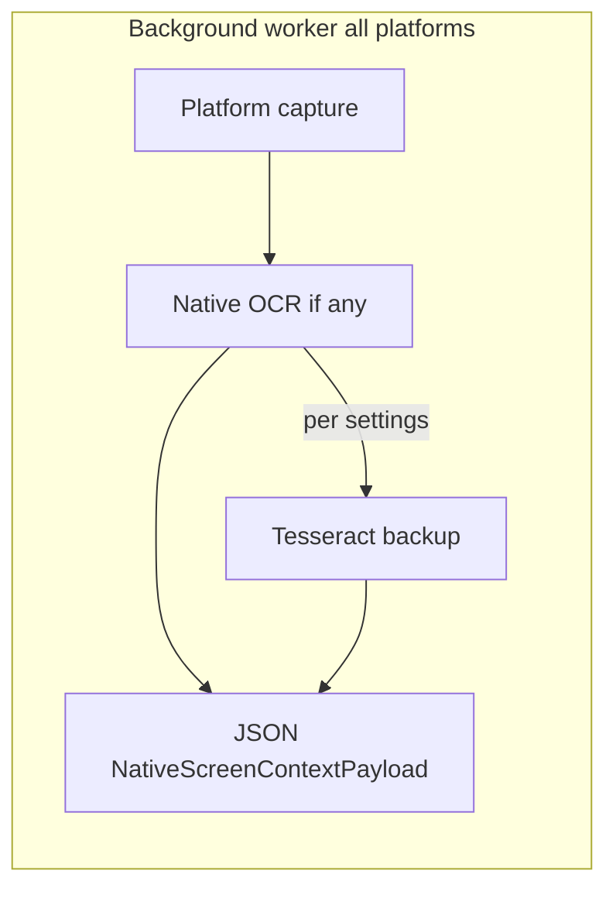

# Cross-platform screen OCR implementation (refined plan)

This document refines the approach for **real screen capture + OCR on Windows and Linux**, replacing the Apple Silicon–only stubs, while keeping the existing **`NativeScreenContextPayload` JSON contract** and **latency-conscious** behavior in [`screen_context.rs`](../src-tauri/src/screen_context.rs).

---

## Goals and constraints

- **Contract unchanged:** `display_id`, `captured_at_ms`, snippets with **Vision-style** boxes: normalized 0–1, **origin bottom-left** (same as [`screen_context.swift`](../src-tauri/swift/screen_context.swift) / [`NativeScreenContextSnippet`](../src-tauri/src/screen_context.rs)).
- **Hot path:** Respect `screen_context_ocr_timeout_ms`, avoid blocking dictation on uncached capture where possible; keep **background worker** wake frequency aligned with existing macOS logic.
- **Latency policy ([`AGENTS.md`](../AGENTS.md)):** No extra blocking I/O or model load on the dictation stop path beyond what macOS already does; backup OCR runs on the **worker thread**, with **downscaling** and **lazy** Tesseract process reuse where practical.
- **Untrusted content:** Preserve redaction / injection-hardening that already applies to OCR snippets.

---

## Resolved product decisions

### 1) Linux capture (Wayland vs X11)

| Phase             | Approach                                                                                                                                                                                                                                                                                                     | Rationale                                                                                                            |
| ----------------- | ------------------------------------------------------------------------------------------------------------------------------------------------------------------------------------------------------------------------------------------------------------------------------------------------------------ | -------------------------------------------------------------------------------------------------------------------- |
| **Phase 1 (MVP)** | **X11:** capture via Rust (`x11rb` / `xcb` + shared memory or `XGetImage`–class path) **without** requiring `scrot`. **Wayland:** if `grim` is on `PATH`, use **`grim -t png -`** (full output) into memory; otherwise return a clear error asking the user to install `grim` **or** run under XWayland/X11. | Ships faster than D-Bus + PipeWire; avoids large GStreamer/PW deps for MVP. Many wlroots-based desktops ship `grim`. |
| **Phase 2**       | **`ashpd` + PipeWire** (or equivalent portal screen-cast) for **generic** Wayland (GNOME/KDE) without `grim`.                                                                                                                                                                                                | Full coverage; higher complexity and binary size—explicitly deferred.                                                |

**Implication:** Linux diagnostics (`ScreenContextDiagnostics`) should surface **`MissingCaptureTool`** vs **`PermissionDenied`** vs **`WaylandUnsupported`** (exact enum names TBD) so support is actionable.

### 2) Backup OCR: Tesseract first, ONNX later

| Phase                  | Approach                                                                                                                                                                                     | Rationale                                                                                                                                                           |
| ---------------------- | -------------------------------------------------------------------------------------------------------------------------------------------------------------------------------------------- | ------------------------------------------------------------------------------------------------------------------------------------------------------------------- |
| **Phase 1**            | **Subprocess Tesseract** with **TSV** output (`tesseract in.png stdout tsv` with `tessedit_create_tsv=1` in config or CLI `-c`). Parse TSV → `NativeScreenContextSnippet` + normalize boxes. | Fast to integrate; no static link of `libleptonica`; easy to bundle a `tesseract` binary + `tessdata` under app resources (pattern similar to other shipped tools). |
| **Phase 2 (optional)** | **Compact ONNX** det/rec (e.g. PP-OCR mobile ONNX) via existing `ort` patterns in the repo.                                                                                                  | Better accuracy/languages at the cost of integration time and artifact size—only if MVP proves insufficient.                                                        |

**Bundling:** Resolve `tesseract` executable from: user `PATH` → app resource dir (per OS) → documented install step. Same for `TESSDATA_PREFIX` / tessdata next to the binary.

---

## Architecture (high level)

**Engine policy (`ScreenContextOcrEngine`):**

- **`Auto` / `NativeThenBackup` (default):** native (macOS Vision, Windows OCR) when available and language supported; on failure, empty result, or timeout → backup.
- **`NativeOnly`:** Windows/macOS native only; Linux treats as **backup-only** (no OS OCR) unless we add a future native path.
- **`BackupOnly`:** always Tesseract (useful for QA parity, Intel Mac experiments, or debugging native OCR).

---

## Settings and UI (full integration)

### Backend

- **[`src-tauri/src/settings.rs`](../src-tauri/src/settings.rs)**
  - Add `ScreenContextOcrEngine` enum: `Auto`, `NativeOnly`, `BackupOnly`, `NativeThenBackup`.
  - Add `screen_context_ocr_engine` with default **`NativeThenBackup`** (or **`Auto`** alias—pick one name in code and map synonyms in deserializer if needed).
  - Extend defaults, merge helpers, and any `get_settings_without_secrets` plain-data structs if they duplicate screen-context fields.

- **[`src-tauri/src/shortcut/mod.rs`](../src-tauri/src/shortcut/mod.rs)**
  - New command: `change_screen_context_ocr_engine_setting` (mirror existing `change_screen_context_*` pattern: clamp/validate, persist, emit `"settings"` event).

- **[`src-tauri/src/lib.rs`](../src-tauri/src/lib.rs)**
  - Register the new Tauri command in the `invoke_handler` list.

- **Specta / bindings**
  - Ensure the enum is exported so **`src/bindings.ts`** regenerates with the new type and command (project’s usual `specta` flow).

### Frontend

- **[`src/components/settings/screen-context/ScreenContextSettingsSection.tsx`](../src/components/settings/screen-context/ScreenContextSettingsSection.tsx)**
  - Dropdown or radio for OCR engine; wire to `settingsStore` / `commands.changeScreenContextOcrEngineSetting`.

- **i18n**
  - Add keys under English [`src/i18n/locales/en/translation.json`](../src/i18n/locales/en/translation.json) only in the MVP PR; run `bun run check:translations` / sync scripts per [`CLAUDE.md`](../CLAUDE.md) for other locales in a follow-up if needed.

---

## Core Rust modules

### [MODIFY] [`src-tauri/src/screen_context.rs`](../src-tauri/src/screen_context.rs)

- Replace the single broad non–Apple-silicon stub with:
  - `#[cfg(all(target_os = "macos", target_arch = "aarch64"))]` → existing Swift bridge path.
  - `#[cfg(target_os = "windows")]` → `windows_capture::capture_screen_context(...)` (or inline module).
  - `#[cfg(target_os = "linux")]` → `linux_capture::capture_screen_context(...)`.
  - `#[cfg(not(any(...)))]` → retain a narrow stub for unknown targets.
- **`spawn_background_worker`:** compile for **all** desktop targets that implement capture (at minimum Windows + Linux + Apple silicon); keep the same interval / idle / excluded-app logic.
- **`read_ax_field_text`:** on Windows, delegate to **`WindowsFieldTextReader`** (same pattern as [`correction_tracker`](../src-tauri/src/correction_tracker/mod.rs)) so `build_ax_only_packet` can fire when the focused field has text.
- **Permission helpers:** extend `check_screen_recording_permission_*` (or parallel `has_screen_capture_access`) for Windows/Linux so diagnostics match UI expectations.

### [NEW] `src-tauri/src/screen_context_ocr_backup.rs`

- Input: RGBA/BGRA buffer + width/height (or path to temp PNG).
- **Downscale:** cap longest edge (e.g. **1920**; tune with `OcrQualityMode`).
- **Tesseract invocation:** `Command` with timeout aligned to caller; parse **TSV** columns for text, confidence, line bbox in **pixel** space → convert to **normalized bottom-left** (match existing macOS ordering / ranking in `rank_context_packet`).
- **Unit tests:** golden TSV fixtures → expected `NativeScreenContextSnippet` list (box math only; no need to shell out in CI if tests use parsed strings).

### [NEW] `src-tauri/src/screen_context/windows_capture.rs`

- **Capture:** WinRT **Graphics Capture** for the monitor under the cursor (or primary if indeterminate); D3D11 interop → readback BGRA8.
- **Native OCR:** `Windows.Media.Ocr.OcrEngine` on `SoftwareBitmap`; map **Windows** rects (top-left, pixels) → **Vision-style** normalized bottom-left.
- **Engine setting:** honor `ScreenContextOcrEngine`; call backup module when required.
- **Cargo:** extend [`Cargo.toml`](../src-tauri/Cargo.toml) `windows` feature flags as needed (`Graphics_Capture`, `Graphics_DirectX`, `Graphics_DirectX_Direct3D11`, `Graphics_Imaging`, `Media_Ocr`, `Devices_Display`, etc.—minimize to what the code actually uses).

### [NEW] `src-tauri/src/screen_context/linux_capture.rs`

- **Detect session:** `WAYLAND_DISPLAY` vs `DISPLAY`.
- **Phase 1 capture:** X11 Rust path; Wayland `grim` full-screen stdin/stdout path when available.
- **OCR:** no Linux native OCR in MVP—always **backup** (unless `BackupOnly` / `NativeThenBackup` both resolve to Tesseract anyway).
- **display_id:** stable **enumeration index** from platform monitor list; document that it is not comparable to macOS `CGDirectDisplayID`.

### [MODIFY] `src-tauri/src/lib.rs`

- `mod screen_context_ocr_backup;`
- `#[cfg(target_os = "windows")] mod screen_context { pub mod windows_capture; }` — or flatten `screen_context/` directory with `mod.rs` re-exports (prefer a **`screen_context/`** subfolder if `screen_context.rs` grows too large; optional refactor).

---

## macOS notes (optional follow-ups)

- **Apple silicon:** unchanged default path.
- **Intel Mac:** still stubbed today; could later use **ScreenCaptureKit + Tesseract only** (no Vision requirement) behind the same backup pipeline—out of scope unless requested.

---

## Diagnostics and UX

- Extend **`get_screen_context_diagnostics`** / [`ScreenContextDiagnostics`](../src-tauri/src/screen_context.rs) if new statuses are needed (e.g. missing `grim`, Tesseract not found).
- Overlay / settings should continue to use existing events (`screen-context-status`, `screen-context-capture`).

---

## Verification plan

### Automated

- `cargo test` in `src-tauri` (box normalization tests in `screen_context_ocr_backup`; existing `screen_context` tests unchanged behavior on macOS).
- Optional: Linux CI job **without** display server only compiles `linux_capture` with `#[cfg(test)]` mocks—only if flakiness is an issue.

### Manual

- **Windows:** screen capture consent, multi-monitor, DPI scaling, OCR engine toggle, failure fallback to Tesseract.
- **Linux X11:** full-screen capture + Tesseract; token budget and timeout.
- **Linux Wayland:** with `grim` installed (wlroots-style session); without `grim`, confirm actionable error.
- **Regression macOS Apple silicon:** Vision path still default; `BackupOnly` forces Tesseract (if wired on macOS for testing).

---

## Out of scope (explicit)

- Heavy VLMs (PaddleOCR-VL, LightOnOCR, etc.) inside the hot screen-context path.
- Phase 2 **portal + PipeWire** until MVP is stable.
- Linux **AT-SPI** focused-field text for `ax_only` parity (optional later).

---

## Implementation order (suggested)

1. `ScreenContextOcrEngine` + settings + commands + bindings + minimal UI + i18n.
2. `screen_context_ocr_backup.rs` + tests (can develop on macOS with `BackupOnly`).
3. Windows capture + native OCR + worker enablement.
4. Linux capture Phase 1 + worker + diagnostics.
5. Phase 2 Linux portal path (separate PR).

This ordering keeps **Tesseract** testable before platform capture is complete and reduces integration risk.

---

## Runtime dependencies (post-MVP)

After this MVP lands, the user-facing install/setup story is:

### macOS (Apple silicon)

- **No extra setup.** Apple Vision is built into the OS and is the default. The cross-platform engine is only used when the user explicitly switches to **Cross-platform (Tesseract)** in Settings → Screen Context → OCR engine, and requires `tesseract` on `PATH` (`brew install tesseract` is the canonical install).

### Windows

- **No extra setup for the default path.** `Windows.Media.Ocr` is part of Windows 10 / 11 — language packs are added via Settings → Time & Language → Language.
- For the **Cross-platform** fallback: install [Tesseract for Windows](https://github.com/UB-Mannheim/tesseract/wiki) (UB Mannheim builds) and add it to `PATH`, or set the `VOX_JOT_TESSERACT` environment variable to the absolute path of `tesseract.exe`.

### Linux

- **OCR engine:** `tesseract` (`apt install tesseract-ocr` / `dnf install tesseract` / `pacman -S tesseract`).
- **Capture (Wayland):** `grim` (`apt install grim` / `pacman -S grim`). Phase 2 will add a portal + PipeWire path so this dependency can be relaxed.
- **Capture (X11):** ImageMagick `import` (`apt install imagemagick`) or `gnome-screenshot` as a fallback.

When any of these tools is missing, the screen-context settings panel surfaces an actionable error string with the install command.

### CI

- Linux CI does not need a display server: the unit tests in `screen_context_ocr_backup` only exercise the TSV parser + downscaler, both pure Rust. Windows capture is compiled but not exercised in CI today; manual smoke-tests are documented in the verification plan above.

### Bundling (deferred)

- The plan calls for bundling `tesseract` + `tessdata` under `src-tauri/resources/` so end users do not have to install it separately. That work is intentionally deferred — installing via package manager is acceptable for the MVP and avoids a per-platform binary copy in the repo.
